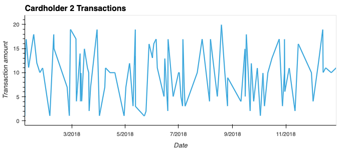
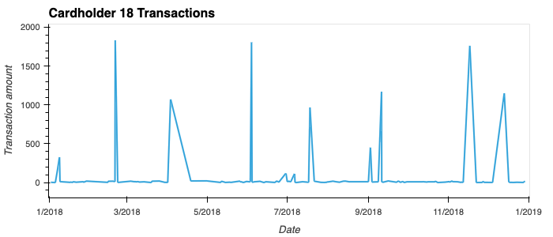
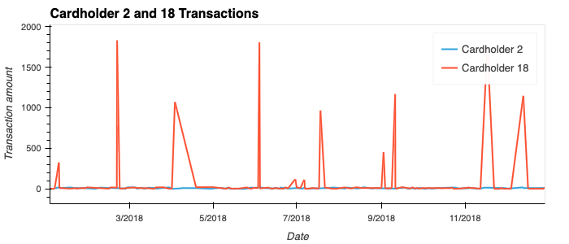

# fraud_detection

The objective of this repository is to analyze historical credit card transactions and consumption patterns using SQL, Python and Pandas to detect possible fraudulent transactions. It is done by completing three tasks: 
1) Defining a database model and creating a PostgresSQL database (See ERD.PNG)
2) Creating and populating a database schema on PostgresSQL (See schema.sql)
3) Analyzing the Data (See queries.sql, challenge.ipynb and visual_data_analysis.ipynb)

Below are the observations from the analysis. 

## Transactions less than $2.00
Calculating the number of transactions that are less than $2 dls (in the "small_transaction" view queries.sql) we can see that all cardholders have transactions less than $2 dolars. However, most of them have 10 or less of these transactions compared to an average of 140 transactions per cardholder. Taking the average of the count of small transactions against the average of 140 transactions we can see that they account to only 5%. Cardholders 12,24 and 20 hold more small transactions then the rest with 16, 14 and 13 small transactions respectively (accounting from 6% to 12% of their transactions). I would recommend keeping an eye on cardholders that have 10 or more transactions to see if they continue to occur or if these transactions continue to increase. 

When looking at the "small_transaction_per_merchant" view in queries, we can see that all merchants have less than 5 transactions less than $2 dolars. Merchants 48,65,141,129,63 and 50 have 4 or 5 transactions. 

## Highest Transactions made between 7:00 am to 9:00 am vs 
Comparing the transactions made between 7am and 9am to the transactions made at other times, we can see that only 10 out of the 100 top transactions exceed $500 dls compared to 80 out of 100 transactions at other times. Given the difference in time range between the two comparisons, I believe the result was to be expected. Additionally, the 10 largest transactions seen in the date between 7am and 9am are of different cardholder which can mean less risk of fraud as opposed to have the same cardholder make all those charges. It is important to note that 86 out of 100 transactions evaluated between 7:00 am to 9:00 am are less than $20, we could look at the risk of small transactions between those time frames for further analyisis. I believe more information would be necessary to make a better assesment.

## Challenge Jupyter Notebook
This notebook includes the calculation of outliers using the standard deviation and the interquartile range (see challenge.ipynb). There are 10 cardholders with outliers which are: 1,3,6,7,9,12,16,18,24,25. Since a great number of transactions have lower amount, our lower limit is less than 0 and the upper limit 

## Visualizatons
The graphs created in this jupyter notebook evaluate the transactions of cardholder 2, 18 and 25.

We looked at the cardholder 2 and 18 together to evaluate risk of fraud. Here is the result
   
   
   
The first thing we can notice in this graph is that the amount range of the transactions is very different between cardholders. Cardholder 2 has a range of $1 to $20 and cardholder 18 $1 to $1839 (See challenge.ipynb). Most of cardholder 18 transactions stay below $100 dolars with a couple of transactions greatly exceeding the regular consumption pattern. I would suggest evaluating with the cardholder those transactions as they appear to be made every two months.

The other evaluated cardholder was cardholder 25, a six box plot was created to visaluize outlier transactions:

By looking at the box plot, we can see that January, March and May have one outlier with an amount between $1,000 and $1,500. April has 3 outliers with one being a little over $1,000 and the other two under $500. However, June has 3 outliers with one being the highest transaction of all (amount $1,813). Compared to the consumption pattern these transactions could be verified with the cardholder, specially the months with more than one outlier. 

